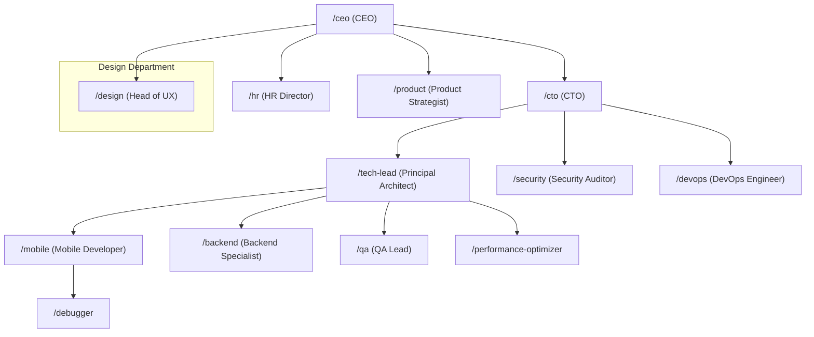

# 🏢 Hierarchical Agent Orchestration: Implementation Plan

**Date:** 2026-01-15
**Objective:** Enable "Boss Agents" to automatically delegate work to specialized sub-agents, and create a self-learning feedback loop.

---

## 🧠 Core Problem

Currently:
*   User must manually call `/mobile`, `/qa`, `/security` etc.
*   Executive agents (CEO, CTO) advise but don't *execute* via sub-agents.
*   Success patterns are not automatically captured.

**Desired State:**
*   User calls `/ceo` and says "Tasarımda renk değiştir."
*   CEO recognizes this as a Design task and **delegates to `/design`**.
*   `/design` (Head of UX) executes and, if successful, triggers `/learn` to save the pattern.

---

## 🏛️ Proposed Chain of Command



---

## 📜 Delegation Protocol (To Be Added to Boss Agents)

Every "Boss Agent" (CEO, CTO, Tech Lead, Head of UX) will receive a new section:

```markdown
## 🔗 Delegation Protocol (Chain of Command)

When a task arrives:
1. **Classify:** Is this Strategy, Tech, Design, or Operations?
2. **Route:** Use the table below to identify the specialist.
3. **Delegate:** Instruct the system to adopt that specialist's persona by reading their agent file.
4. **Monitor:** Review the output for quality.

### My Direct Reports
| Domain | Agent | File |
|--------|-------|------|
| Technical | Tech Lead | `tech-lead.md` |
| Security | Security Auditor | `security-auditor.md` |
| Design | Head of UX | `head-of-ux.md` |
...
```

---

## 📝 Success Logging Protocol (Auto-Learn)

When a task is completed successfully:
1.  Boss Agent prompts: "This was successful. Do you want to save this pattern?"
2.  If yes, Boss activates `knowledge-keeper.md` to extract and log the pattern.

**New Section for All Boss Agents:**
```markdown
## 🧠 Learning Protocol
After successful task completion:
1.  Ask user: "Bu pattern'i kaydedelim mi?"
2.  If yes: Read `knowledge-keeper.md` and execute its protocol.
3.  Append the learning to the relevant Grimoire in `.gemini/knowledge/`.
```

---

## ✅ Execution Checklist

### Phase 1: Update Boss Agents with Delegation Protocol
- [ ] Update `ceo.md` with Chain of Command (CEO -> CTO, HR, Product, Design)
- [ ] Update `cto.md` with Chain of Command (CTO -> Tech Lead, Security, DevOps)
- [ ] Update `tech-lead.md` with Chain of Command (Tech Lead -> Mobile, Backend, QA, Perf)
- [ ] Update `head-of-ux.md` with Chain of Command (Design Lead -> UI Specialists)

### Phase 2: Add Learning Protocol
- [ ] Add "Success Logging" section to all Boss Agents
- [ ] Update `knowledge-keeper.md` to accept domain hints (e.g., "save to flutter_testing.md")

### Phase 3: Deploy & Sync
- [ ] Run `AutoSync-MegaStudio.ps1`

---

## 🎯 Expected Outcome

*   User: `/ceo 'Animasyonda bir jank var, düzelt.'`
*   CEO: "Bu teknik bir konu. CTO'ya aktarıyorum."
*   CTO: "Bu performans konusu. Tech Lead'e aktarıyorum."
*   Tech Lead: "Bu Mobile domeni. Mobile Dev'e aktarıyorum. Ayrıca Debugger'ı da dahil ediyorum."
*   Mobile Dev + Debugger: Sorunu çözer.
*   Tech Lead: "Başarılı. Pattern'i kaydedelim mi? -> `/learn`"
