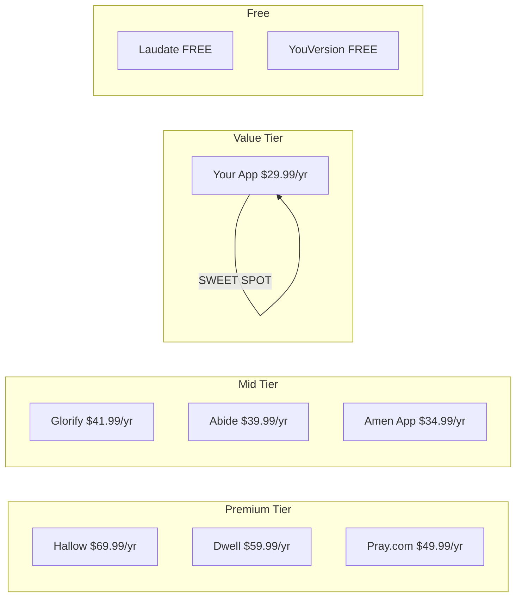

# Amen Christian Daily Guide - Pricing Analysis Report

> **Date:** January 15, 2026  
> **Prepared by:** Deep Research Specialist (The Oracle)  
> **Objective:** Optimal Monthly & Yearly Subscription Pricing Recommendation

---

## Executive Summary

Based on comprehensive market research of 10+ Christian devotional apps, I recommend the following pricing structure for **Amen Christian Daily Guide**:

| Plan | Recommended Price | Effective Monthly | Market Position |
|------|-------------------|-------------------|-----------------|
| **Monthly** | **$4.99/mo** | $4.99 | Entry-level, accessible |
| **Yearly** | **$29.99/yr** | $2.50 | Best value, 50% savings |

> [!IMPORTANT]
> **Key Decision:** Remove lifetime pricing. Focus on subscription model for sustainable revenue.

---

## 1. Competitor Pricing Analysis

### 1.1 Premium Christian Apps (High-End)

| App | Monthly | Yearly | Effective/Mo | Key Features |
|-----|---------|--------|--------------|--------------|
| **Hallow** | $10.99 | $69.99 | $5.83 | Guided prayers, meditations, sleep stories, 10K+ sessions |
| **Pray.com** | $14.99 | $49.99 | $4.17 | Bible Experience, podcasts, community |
| **Dwell** | $9.99 | $59.99 | $5.00 | Audio Bible, multiple voices |

### 1.2 Mid-Range Christian Apps

| App | Monthly | Yearly | Effective/Mo | Key Features |
|-----|---------|--------|--------------|--------------|
| **Glorify** | $6.99 | $41.99-$69.99 | $3.50-$5.83 | Devotionals, quotes, Bible passages |
| **Abide** | $9.99 | $39.99 | $3.33 | Guided meditation, sleep stories |
| **Amen App** | $5.99 | $34.99 | $2.92 | Daily meditations, prayers, Scripture |
| **Phileo** | $9.99 | N/A | $9.99 | AI-powered devotionals |

### 1.3 Budget & Free Options

| App | Pricing | Key Features |
|-----|---------|--------------|
| **Laudate** | FREE | Comprehensive Catholic app (Rosary, Confession guide, readings) |
| **YouVersion** | FREE | 500M+ downloads, Bible translations, reading plans |
| **Echo Prayer** | $4.99/mo | Prayer request organization |

---

## 2. Feature Comparison Matrix

### 2.1 Amen Christian Daily Guide Features

| Feature | Amen App | Hallow | Abide | Glorify | Laudate |
|---------|----------|--------|-------|---------|---------|
| 📖 Bible Reading | ✅ | ✅ | ❌ | ✅ | ✅ |
| 🙏 Daily Prayers | ✅ | ✅ | ✅ | ✅ | ✅ |
| 💭 Confession Companion | ✅ | ⚠️ Partial | ❌ | ❌ | ✅ |
| 📊 Mood Tracker | ✅ | ❌ | ❌ | ❌ | ❌ |
| 📓 Spiritual Journal | ✅ | ⚠️ Paid | ❌ | ❌ | ❌ |
| 🔥 Novena Prayers | ✅ | ⚠️ Limited | ❌ | ❌ | ✅ |
| 📅 Liturgical Calendar | ✅ | ✅ | ❌ | ❌ | ✅ |
| 📍 Church Map | ✅ | ❌ | ❌ | ❌ | ❌ |
| 🏆 Streak/Journey | ✅ | ✅ | ✅ | ✅ | ❌ |
| 📶 Offline Mode | ✅ | ⚠️ Paid | ⚠️ Paid | ⚠️ Paid | ✅ |
| 🎧 Guided Meditations | ❌ | ✅ | ✅ | ✅ | ❌ |
| 😴 Sleep Stories | ❌ | ✅ | ✅ | ❌ | ❌ |

> [!TIP]
> **Unique Differentiators:** Confession Companion + Mood Tracker + Church Map + Novena prayers is a combination NO competitor offers.

---

## 3. Market Insights

### 3.1 Price Elasticity in Christian App Market

Research indicates:

- **High Sensitivity:** Christian users are particularly sensitive to pricing
- **Ethical Expectations:** Many believe spiritual resources should be affordable/free
- **Value Perception:** Pricing must clearly match perceived spiritual value

### 3.2 Successful Pricing Patterns

| Strategy | Details |
|----------|---------|
| **Annual = 10 Months** | Price annual at ~10× monthly for perceived savings |
| **50% Savings Badge** | Strong conversion driver for yearly plans |
| **Free Trial** | 3-7 day trials significantly boost conversions |
| **Freemium Base** | Generous free tier with premium upgrades |

---

## 4. Pricing Recommendation

### 4.1 Optimal Pricing Structure

```
┌─────────────────────────────────────────────────────────────┐
│                    RECOMMENDED PRICING                       │
├─────────────────────────────────────────────────────────────┤
│  MONTHLY:  $4.99/month                                       │
│  ├─ Free Trial: 3-day                                        │
│  └─ Cancellation: Anytime                                    │
│                                                              │
│  YEARLY:   $29.99/year  (Save 50%)                           │
│  ├─ Free Trial: 7-day                                        │
│  ├─ Effective: $2.50/month                                   │
│  └─ Badge: "BEST VALUE"                                      │
└─────────────────────────────────────────────────────────────┘
```

### 4.2 Pricing Rationale

| Factor | Justification |
|--------|---------------|
| **Monthly $4.99** | Below Glorify ($6.99), matches Echo Prayer, competitive entry point |
| **Yearly $29.99** | Matches your current pricing, aligned with Amen App ($34.99) |
| **50% Savings** | Annual = 6× monthly (not 12×), strong psychological incentive |
| **No Lifetime** | Subscription = predictable revenue + ongoing feature updates |

### 4.3 Market Position



---

## 5. Competitive Advantage Analysis

### 5.1 Why $29.99/year Works

| Advantage | Details |
|-----------|---------|
| **Undercuts Mid-Tier** | $10-15 cheaper than Abide/Amen App/Glorify |
| **Feature Parity+** | More unique features (Confession, Mood, Map) |
| **Catholic Niche** | Only Laudate (free) competes in Catholic space |
| **Value Perception** | Premium features at budget pricing |

### 5.2 Risk Analysis

| Risk | Mitigation |
|------|------------|
| **Too cheap = low quality perception** | Strong onboarding, premium UI, feature showcase |
| **Missing audio content** | Future roadmap for guided meditations |
| **Laudate is free** | Your app has better UX, Mood Tracker, and Journal |

---

## 6. Actionable Recommendations

### 6.1 Immediate Actions

1. ✅ **Remove Lifetime pricing** - Focus on subscription for sustainable revenue
2. ✅ **Set Monthly at $4.99** - Competitive entry point
3. ✅ **Keep Yearly at $29.99** - Already well-positioned
4. ✅ **Add "Save 50%" badge** - Highlight annual savings
5. ✅ **Offer 7-day free trial** - Reduces conversion friction

### 6.2 Future Considerations

| Feature | Priority | Impact on Pricing |
|---------|----------|-------------------|
| Guided Meditations | High | Could justify $6.99/mo in future |
| Sleep Stories | Medium | Premium add-on potential |
| Family Plan ($49.99/yr) | Medium | Expands addressable market |
| Audio Bible | Low | Enhances perceived value |

---

## 7. Final Verdict

> [!IMPORTANT]
> **The Oracle's Recommendation:**  
> **Monthly: $4.99 | Yearly: $29.99 (Save 50%)**
> 
> This positions Amen Christian Daily Guide as the **best value Catholic devotional app** in the market - offering premium features (Confession, Mood, Journal, Novena, Map) at a price point $10-40 below competitors.

### Summary Table

| Metric | Current | Recommended | Change |
|--------|---------|-------------|--------|
| Monthly | $6.98 | **$4.99** | -$1.99 |
| Yearly | $29.98 | **$29.99** | +$0.01 |
| Lifetime | $69.98 | **REMOVE** | N/A |
| Yearly Discount | 30% | **50%** | +20% |

---

*Report generated based on market research from Hallow, Abide, Pray.com, Glorify, Amen App, Dwell, Laudate, YouVersion, Phileo, and Echo Prayer. Prices accurate as of January 2026.*
