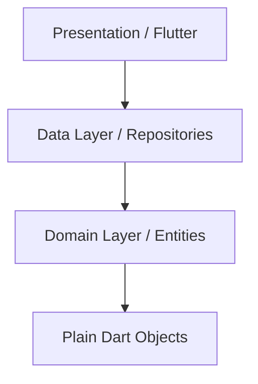

# Architecture Skill 🏛️

> **"A good architecture allows major decisions to be deferred."** — Robert C. Martin

## 🎯 Purpose
This skill provides the knowledge required to design scalable, maintainable software systems.
It is primarily used by the `cto.md`, `software-architect.md`, and `tech-lead.md`.

---

## 🧅 The Dependency Rule (Visualized)
> **The center (Domain) knows NOTHING about the outer layers (Data/UI).**

*   **Correct:** `Controller` imports `UserEntity`.
*   **Fatal Error:** `UserEntity` imports `material.dart`.

## 📚 Principles

### 1. SOLID Principles
-   **S**ingle Responsibility: A class should have one, and only one, reason to change.
-   **O**pen/Closed: Open for extension, closed for modification.
-   **L**iskov Substitution: Subtypes must be substitutable for their base types.
-   **I**nterface Segregation: Many client-specific interfaces are better than one general-purpose interface.
-   **D**ependency Inversion: Depend upon abstractions, not concretions.

### 2. Clean Architecture (The Onion)
-   **Entities:** Enterprise business rules (Pure Dart/JS objects).
-   **Use Cases:** Application business rules (Interactors).
-   **Interface Adapters:** Presenters, Controllers, Gateways.
-   **Frameworks & Drivers:** UI, Database, Devices.

---

## 🛠️ Pattern Library

### 1. MVVM (Model-View-ViewModel)
-   **View:** The UI (Flutter Widgets). Passive. Listens to ViewModel.
-   **ViewModel:** The logic. Holds state. Exposes streams/notifiers.
-   **Model:** The data.

### 2. Repository Pattern
-   Abstacts the data source (API vs Database).
-   Allows swapping Firebase for SQL without breaking the UI.

### 3. Feature-First Packaging
GROUP BY FEATURE, NOT TYPE.
-   ✅ `features/auth/login_screen.dart`
-   ✅ `features/auth/auth_controller.dart`
-   ❌ `screens/login_screen.dart`
-   ❌ `controllers/auth_controller.dart`

---

## ⚠️ Anti-Patterns to Avoid
-   **God Classes:** A single class doing everything (e.g., `UserManager` with 5000 lines).
-   **Spaghetti Code:** Unstructured, tangled control flow.
-   **Tight Coupling:** Classes A and B knowing too much about each other.
